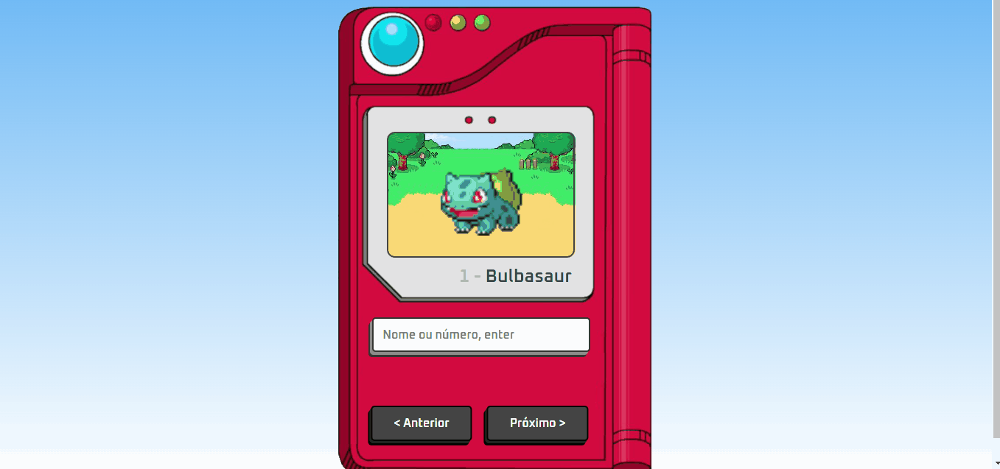

<h1 align="center">Projeto Pokedex</h1>

Uma pokedex para saber mais sobre APIs

## Link do vídeo: https://www.youtube.com/watch?v=SjtdH3dWLa8&t=71s

[]

## Tecnologias usadas:

- HTML
- CSS
- JS
- https://pokeapi.co/ (API)

## Assuntos que aprendi

- API
- Saber mais sobre coordenação de HTML e CSS